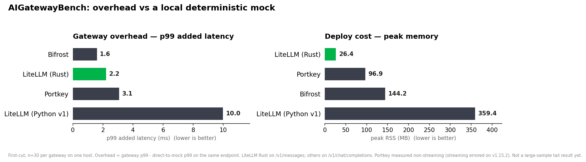

# AIGatewayBench

A reproducible benchmark for **AI-gateway overhead**: the latency, memory, and resource cost a gateway adds on top of the upstream LLM, measured through the lens of a coding agent.

Every gateway points at the same local deterministic mock, so provider latency and network noise are removed and what's left is the gateway's own overhead:

```
overhead = latency(client -> gateway -> mock) - latency(client -> mock directly)
```

Gateways compared: LiteLLM (Rust), LiteLLM (Python v1), Portkey, Bifrost.



## What it tests

Each scenario is one folder under `scenarios/`. Load/streaming scenarios use Locust; the rest are plain Python scripts.

| Metric | Why it matters for agents | Folder |
|---|---|---|
| TTFT + inter-chunk latency & jitter | An agent streams every turn; buffering or stutter is felt directly | `scenarios/streaming_turn` |
| Tool-call latency + argument-delta reassembly | Tool calls are the heavy path; reordered/mangled args break an edit | `scenarios/tool_call_loop` |
| Overhead vs prompt size (1k/10k/100k) | Agents paste whole files; parse/serialize cost grows with context | `scenarios/large_context` |
| p99 inter-chunk latency + chunk fidelity under load | The moat metric: does the tail stay flat and 1:1 as concurrency rises | `scenarios/concurrent_agents` |
| Edge rejection of invalid/rotating keys | An abusive key flood should be rejected cheaply, not hit the upstream | `scenarios/security_key_flood` |
| Failover / error-path overhead | Cost of the retry/fallback path when the upstream returns 429/500 | `scenarios/failover_overhead` |
| Head-of-line blocking | Does one 100k-token request stall small streaming turns | `scenarios/head_of_line` |
| Peak RSS, idle RSS, memory growth | How cheap to deploy, and whether it drifts toward OOM under load | `tools/mem_sampler.py` (run alongside any scenario) |

See [`docs/WHAT_THE_BENCH_TESTS.md`](docs/WHAT_THE_BENCH_TESTS.md) for the full rationale and the moat-metric argument.

## Running it

```bash
python -m venv .venv && . .venv/bin/activate && pip install -r requirements.txt

# 1. start the deterministic mock upstream
uvicorn mock.app:app --port 9000

# 2. start a gateway pointed at the mock (see gateways/<name>/README.md)

# 3. run a scenario, e.g. a Locust load test
locust -f scenarios/streaming_turn/locustfile.py --headless -u 16 -r 16 -t 30s \
  --host http://127.0.0.1:<gateway-port>

# 4. regenerate the chart from results/
python analyze/make_chart.py
```

Per-gateway setup (how to start each and point it at the mock) is in `gateways/<name>/README.md`. Measured results land in `results/`; the chart reads `results/overhead_summary.json` and the `results/mem_*.txt` summaries.

## Results

The published chart is generated from real runs, not placeholders. Current numbers are a first cut (n=30, single host); methodology and sample size are noted on the chart. Raw per-run data is in `results/`.
